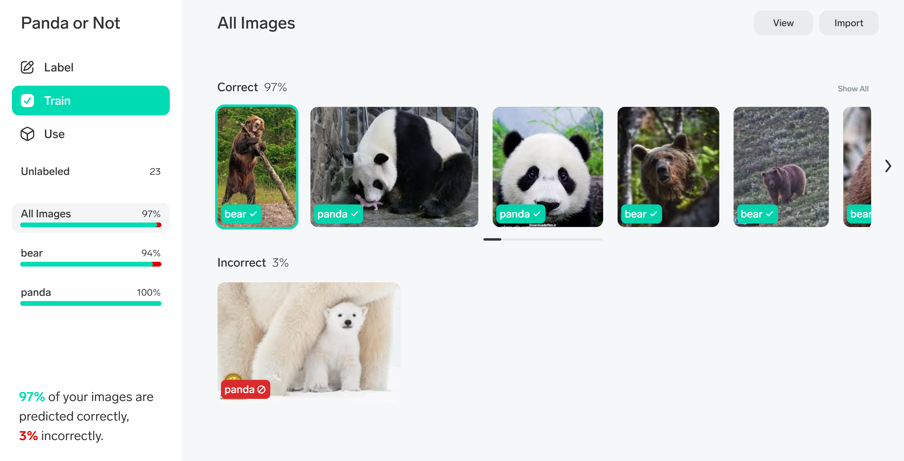

# Assignment 37 : INTRODUCTION TO MACHINE LEARNING

## How to Install
Run following command :
```
pip install -r requirments.txt
```

## First part : Make a Dataset
I used image proccessing to make a dataset from a photo.
You can see the result in outputs folder.

## Second part : Lobe
I used Lobe softwar to detect pandas from different kind of animals. Here is the result :


## Third part : Matplotlib Tutorial
For this assignment I read W3Schools Matplotlib tutorial completely, and I tried to use all different codes in my assignment.

## Fourth part : Python Machine Learning Tutorial
For this assignment I read W3Schools Machine Learning tutorial completely, and I tried to use all different codes in my assignment.
