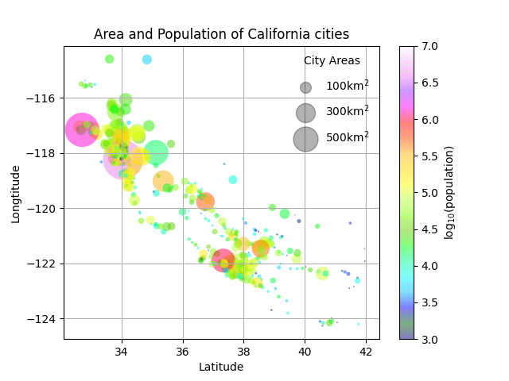

# Assignment 38 : DATA SCIENCE

## How to Install
Run following command :
```
pip install -r requirments.txt
```

## First part : Sololearn Certificate
Get 'Coding for Data' certificate from sololearn.

## Second part : Correct Statement
Correct statement : As data science is not a discipline traditionally taught at universities, contemporary data scientists come from diverse backgrounds such as engineering, statistics, and physics.

## Third part : Apples 🍎 & Bananas 🍌
In this assignment I produce a database from width and length of 1000 applea and 1000 bananas with random command.
And I used different plots to show my information :


## Fourth part : Balloons 🎈 & Melons 🍈

## Fifth Part : California Cities 
In this assignment I used the california cities dataset and show its information in a scatter with matplotlib library.
Final result is :
